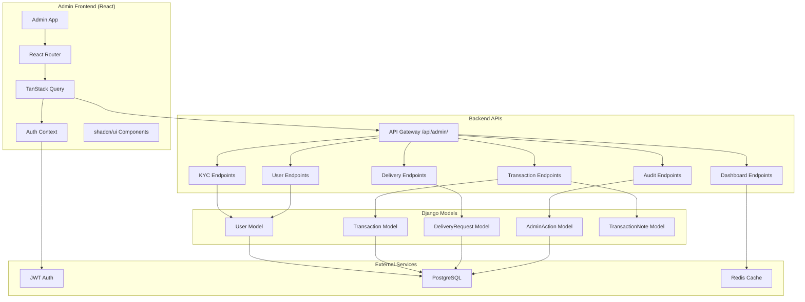

# Design Document: Admin Management System

## Overview

The Admin Management System is a comprehensive administrative interface for the Precious Vault platform, consisting of a dedicated React frontend application and Django REST API backend. The system enables platform administrators to manage KYC verification, review transactions, oversee user accounts, coordinate physical deliveries, and monitor platform health. All administrative actions are logged for audit compliance.

The system integrates with existing Django models (User, Transaction, DeliveryRequest) and extends the admin_api app with new endpoints and serializers. The frontend is a separate React application in `precious-vault-admin/` that communicates with backend APIs under `/api/admin/`.

## Architecture

### System Components



### Technology Stack

**Backend:**
- Django 5.0 + Django REST Framework
- JWT authentication (djangorestframework-simplejwt)
- PostgreSQL for data persistence
- Redis for caching dashboard metrics
- Existing admin_api Django app

**Frontend:**
- React 18 + TypeScript
- Vite build tool
- TanStack Query for server state
- React Router v6 for navigation
- Axios for HTTP requests
- shadcn/ui + Tailwind CSS for UI
- React Hook Form + Zod for forms

### Deployment Architecture

The admin frontend is a separate Docker container that runs alongside the main platform:

```
precious-vault/
├── precious-vault-backend/      # Existing backend
│   └── admin_api/               # Admin endpoints
├── precious-vault-frontend/     # Main user frontend
└── precious-vault-admin/        # New admin frontend
```

Both frontends communicate with the same backend but admin endpoints require staff privileges.

## Components and Interfaces

### Backend API Endpoints

#### KYC Management Endpoints

```
GET    /api/admin/kyc/pending/
GET    /api/admin/kyc/{user_id}/
POST   /api/admin/kyc/{user_id}/approve/
POST   /api/admin/kyc/{user_id}/reject/
GET    /api/admin/kyc/{user_id}/documents/
GET    /api/admin/kyc/{user_id}/history/
```

#### Transaction Management Endpoints

```
GET    /api/admin/transactions/pending/
GET    /api/admin/transactions/{id}/
POST   /api/admin/transactions/{id}/approve/
POST   /api/admin/transactions/{id}/reject/
POST   /api/admin/transactions/{id}/notes/
GET    /api/admin/transactions/
```

#### User Management Endpoints

```
GET    /api/admin/users/
GET    /api/admin/users/{id}/
POST   /api/admin/users/{id}/suspend/
POST   /api/admin/users/{id}/activate/
POST   /api/admin/users/{id}/adjust-balance/
GET    /api/admin/users/{id}/activity/
GET    /api/admin/users/search/?q={query}
```

#### Delivery Management Endpoints

```
GET    /api/admin/deliveries/
GET    /api/admin/deliveries/{id}/
PATCH  /api/admin/deliveries/{id}/
POST   /api/admin/deliveries/{id}/update-status/
POST   /api/admin/deliveries/{id}/assign-carrier/
GET    /api/admin/deliveries/{id}/history/
```

#### Dashboard Endpoints

```
GET    /api/admin/dashboard/metrics/
GET    /api/admin/dashboard/recent-actions/
GET    /api/admin/dashboard/alerts/
GET    /api/admin/dashboard/vault-inventory/
GET    /api/admin/dashboard/metal-prices/
GET    /api/admin/dashboard/transaction-volume/
```

#### Audit Log Endpoints

```
GET    /api/admin/audit/
GET    /api/admin/audit/{id}/
```

### Backend Serializers

#### AdminKYCSerializer
```python
class AdminKYCSerializer(serializers.ModelSerializer):
    user_email = serializers.EmailField(source='email', read_only=True)
    user_name = serializers.CharField(source='get_full_name', read_only=True)
    documents = IdentityDocumentSerializer(many=True, read_only=True)
    
    class Meta:
        model = User
        fields = ['id', 'user_email', 'user_name', 'kyc_status', 
                  'kyc_submitted_at', 'documents', 'created_at']
```

#### AdminTransactionSerializer
```python
class AdminTransactionSerializer(serializers.ModelSerializer):
    user_email = serializers.EmailField(source='user.email', read_only=True)
    metal_name = serializers.CharField(source='metal.name', read_only=True)
    notes = TransactionNoteSerializer(many=True, read_only=True)
    
    class Meta:
        model = Transaction
        fields = ['id', 'user', 'user_email', 'transaction_type', 
                  'metal', 'metal_name', 'quantity', 'price_per_unit',
                  'total_amount', 'status', 'created_at', 'notes']
```

#### AdminUserDetailSerializer
```python
class AdminUserDetailSerializer(serializers.ModelSerializer):
    wallet_balance = serializers.DecimalField(source='wallet.balance', 
                                              max_digits=15, decimal_places=2)
    portfolio = PortfolioItemSerializer(many=True, read_only=True)
    recent_transactions = AdminTransactionSerializer(many=True, read_only=True)
    
    class Meta:
        model = User
        fields = ['id', 'email', 'first_name', 'last_name', 'kyc_status',
                  'is_active', 'wallet_balance', 'portfolio', 
                  'recent_transactions', 'date_joined', 'last_login']
```

#### AdminDeliverySerializer
```python
class AdminDeliverySerializer(serializers.ModelSerializer):
    user_email = serializers.EmailField(source='user.email', read_only=True)
    items = DeliveryItemSerializer(many=True, read_only=True)
    history = DeliveryHistorySerializer(many=True, read_only=True)
    
    class Meta:
        model = DeliveryRequest
        fields = ['id', 'user', 'user_email', 'status', 'carrier',
                  'tracking_number', 'shipping_address', 'items',
                  'history', 'created_at', 'updated_at']
```

#### DashboardMetricsSerializer
```python
class DashboardMetricsSerializer(serializers.Serializer):
    total_users = serializers.IntegerField()
    active_users_30d = serializers.IntegerField()
    pending_kyc = serializers.IntegerField()
    pending_transactions = serializers.IntegerField()
    active_deliveries = serializers.IntegerField()
    total_transaction_volume_30d = serializers.DecimalField(max_digits=15, decimal_places=2)
    trends = serializers.DictField()
```

### Backend ViewSets and Views

#### KYCManagementViewSet
```python
class KYCManagementViewSet(viewsets.ViewSet):
    permission_classes = [IsAdminUser]
    
    @action(detail=False, methods=['get'])
    def pending(self, request):
        """List all pending KYC requests"""
        
    @action(detail=True, methods=['post'])
    def approve(self, request, pk=None):
        """Approve a KYC request"""
        
    @action(detail=True, methods=['post'])
    def reject(self, request, pk=None):
        """Reject a KYC request with reason"""
        
    @action(detail=True, methods=['get'])
    def documents(self, request, pk=None):
        """Get user's identity documents"""
        
    @action(detail=True, methods=['get'])
    def history(self, request, pk=None):
        """Get KYC submission history"""
```

#### TransactionManagementViewSet
```python
class TransactionManagementViewSet(viewsets.ModelViewSet):
    permission_classes = [IsAdminUser]
    queryset = Transaction.objects.all()
    serializer_class = AdminTransactionSerializer
    
    @action(detail=False, methods=['get'])
    def pending(self, request):
        """List pending transactions"""
        
    @action(detail=True, methods=['post'])
    def approve(self, request, pk=None):
        """Approve a pending transaction"""
        
    @action(detail=True, methods=['post'])
    def reject(self, request, pk=None):
        """Reject a pending transaction"""
        
    @action(detail=True, methods=['post'])
    def notes(self, request, pk=None):
        """Add a note to a transaction"""
```

#### UserManagementViewSet
```python
class UserManagementViewSet(viewsets.ModelViewSet):
    permission_classes = [IsAdminUser]
    queryset = User.objects.all()
    serializer_class = AdminUserDetailSerializer
    
    @action(detail=False, methods=['get'])
    def search(self, request):
        """Search users by email, username, or ID"""
        
    @action(detail=True, methods=['post'])
    def suspend(self, request, pk=None):
        """Suspend a user account"""
        
    @action(detail=True, methods=['post'])
    def activate(self, request, pk=None):
        """Activate a suspended account"""
        
    @action(detail=True, methods=['post'])
    def adjust_balance(self, request, pk=None):
        """Adjust user wallet balance"""
        
    @action(detail=True, methods=['get'])
    def activity(self, request, pk=None):
        """Get user activity timeline"""
```

#### DeliveryManagementViewSet
```python
class DeliveryManagementViewSet(viewsets.ModelViewSet):
    permission_classes = [IsAdminUser]
    queryset = DeliveryRequest.objects.all()
    serializer_class = AdminDeliverySerializer
    
    @action(detail=True, methods=['post'])
    def update_status(self, request, pk=None):
        """Update delivery status"""
        
    @action(detail=True, methods=['post'])
    def assign_carrier(self, request, pk=None):
        """Assign carrier and tracking number"""
        
    @action(detail=True, methods=['get'])
    def history(self, request, pk=None):
        """Get delivery history events"""
```

#### DashboardView
```python
class DashboardView(APIView):
    permission_classes = [IsAdminUser]
    
    def get(self, request):
        """Get dashboard overview data"""
        
class DashboardMetricsView(APIView):
    permission_classes = [IsAdminUser]
    
    def get(self, request):
        """Get detailed metrics with caching"""
        
class DashboardAlertsView(APIView):
    permission_classes = [IsAdminUser]
    
    def get(self, request):
        """Get items requiring attention"""
```

### Frontend Components

#### Page Components

**DashboardPage.tsx**
- Displays key metrics cards
- Recent admin actions list
- Alerts requiring attention
- Quick links to pending items

**KYCManagementPage.tsx**
- Pending KYC requests table
- KYC detail modal with document viewer
- Approve/reject actions with reason input
- KYC history timeline

**TransactionManagementPage.tsx**
- Pending transactions table with filters
- Transaction detail modal
- Approve/reject actions
- Transaction notes interface
- Search and filter controls

**UserManagementPage.tsx**
- User search interface
- User list table with pagination
- User detail modal with activity timeline
- Suspend/activate actions
- Balance adjustment form

**DeliveryManagementPage.tsx**
- Delivery requests table with status filters
- Delivery detail modal
- Status update form
- Carrier assignment form
- Delivery history timeline

**AuditLogPage.tsx**
- Audit log table with filters
- Action detail modal
- Filter by admin user, action type, date range

#### Shared Components

**AdminLayout.tsx**
- Navigation sidebar
- Header with admin user info
- Logout functionality
- Breadcrumb navigation

**DataTable.tsx**
- Reusable table with sorting, pagination, filtering
- Column configuration
- Row selection for bulk operations
- Loading and empty states

**ActionModal.tsx**
- Reusable modal for approve/reject actions
- Reason input field
- Confirmation buttons
- Loading states

**MetricCard.tsx**
- Display metric value
- Trend indicator (up/down)
- Icon and label
- Click action for drill-down

**StatusBadge.tsx**
- Color-coded status display
- Consistent styling across features
- Supports all status types (pending, approved, rejected, etc.)

**DocumentViewer.tsx**
- Image display with zoom
- Download button
- Navigation between multiple documents
- Full-screen mode

### Frontend Hooks

#### useKYCManagement.ts
```typescript
export function useKYCManagement() {
  const queryClient = useQueryClient();
  
  const pendingKYC = useQuery({
    queryKey: ['admin', 'kyc', 'pending'],
    queryFn: () => api.get('/api/admin/kyc/pending/'),
    refetchInterval: 30000
  });
  
  const approveKYC = useMutation({
    mutationFn: (userId: number) => 
      api.post(`/api/admin/kyc/${userId}/approve/`),
    onSuccess: () => {
      queryClient.invalidateQueries(['admin', 'kyc']);
      queryClient.invalidateQueries(['admin', 'dashboard']);
    }
  });
  
  const rejectKYC = useMutation({
    mutationFn: ({ userId, reason }: { userId: number; reason: string }) =>
      api.post(`/api/admin/kyc/${userId}/reject/`, { reason }),
    onSuccess: () => {
      queryClient.invalidateQueries(['admin', 'kyc']);
      queryClient.invalidateQueries(['admin', 'dashboard']);
    }
  });
  
  return { pendingKYC, approveKYC, rejectKYC };
}
```

#### useTransactionManagement.ts
```typescript
export function useTransactionManagement() {
  const queryClient = useQueryClient();
  
  const pendingTransactions = useQuery({
    queryKey: ['admin', 'transactions', 'pending'],
    queryFn: () => api.get('/api/admin/transactions/pending/'),
    refetchInterval: 30000
  });
  
  const approveTransaction = useMutation({
    mutationFn: (txId: number) =>
      api.post(`/api/admin/transactions/${txId}/approve/`),
    onSuccess: () => {
      queryClient.invalidateQueries(['admin', 'transactions']);
      queryClient.invalidateQueries(['admin', 'dashboard']);
    }
  });
  
  const rejectTransaction = useMutation({
    mutationFn: ({ txId, reason }: { txId: number; reason: string }) =>
      api.post(`/api/admin/transactions/${txId}/reject/`, { reason }),
    onSuccess: () => {
      queryClient.invalidateQueries(['admin', 'transactions']);
      queryClient.invalidateQueries(['admin', 'dashboard']);
    }
  });
  
  const addNote = useMutation({
    mutationFn: ({ txId, note }: { txId: number; note: string }) =>
      api.post(`/api/admin/transactions/${txId}/notes/`, { note }),
    onSuccess: () => {
      queryClient.invalidateQueries(['admin', 'transactions']);
    }
  });
  
  return { pendingTransactions, approveTransaction, rejectTransaction, addNote };
}
```

#### useUserManagement.ts
```typescript
export function useUserManagement() {
  const queryClient = useQueryClient();
  
  const searchUsers = useQuery({
    queryKey: ['admin', 'users', 'search'],
    queryFn: ({ queryKey }) => {
      const [, , , query] = queryKey;
      return api.get(`/api/admin/users/search/?q=${query}`);
    },
    enabled: false
  });
  
  const suspendUser = useMutation({
    mutationFn: ({ userId, reason }: { userId: number; reason: string }) =>
      api.post(`/api/admin/users/${userId}/suspend/`, { reason }),
    onSuccess: () => {
      queryClient.invalidateQueries(['admin', 'users']);
    }
  });
  
  const activateUser = useMutation({
    mutationFn: (userId: number) =>
      api.post(`/api/admin/users/${userId}/activate/`),
    onSuccess: () => {
      queryClient.invalidateQueries(['admin', 'users']);
    }
  });
  
  const adjustBalance = useMutation({
    mutationFn: ({ userId, amount, reason }: { 
      userId: number; 
      amount: number; 
      reason: string 
    }) =>
      api.post(`/api/admin/users/${userId}/adjust-balance/`, { amount, reason }),
    onSuccess: () => {
      queryClient.invalidateQueries(['admin', 'users']);
    }
  });
  
  return { searchUsers, suspendUser, activateUser, adjustBalance };
}
```

#### useDashboard.ts
```typescript
export function useDashboard() {
  const metrics = useQuery({
    queryKey: ['admin', 'dashboard', 'metrics'],
    queryFn: () => api.get('/api/admin/dashboard/metrics/'),
    refetchInterval: 60000,
    staleTime: 30000
  });
  
  const recentActions = useQuery({
    queryKey: ['admin', 'dashboard', 'recent-actions'],
    queryFn: () => api.get('/api/admin/dashboard/recent-actions/'),
    refetchInterval: 30000
  });
  
  const alerts = useQuery({
    queryKey: ['admin', 'dashboard', 'alerts'],
    queryFn: () => api.get('/api/admin/dashboard/alerts/'),
    refetchInterval: 30000
  });
  
  return { metrics, recentActions, alerts };
}
```

## Data Models

### Existing Models (Reference)

The system uses existing Django models from the platform:

**User Model (users app)**
```python
class User(AbstractUser):
    email = models.EmailField(unique=True)
    kyc_status = models.CharField(
        max_choices=[('unverified', 'Unverified'), 
                     ('pending', 'Pending'), 
                     ('verified', 'Verified')]
    )
    kyc_submitted_at = models.DateTimeField(null=True, blank=True)
    is_active = models.BooleanField(default=True)
```

**Transaction Model (trading app)**
```python
class Transaction(models.Model):
    user = models.ForeignKey(User, on_delete=models.CASCADE)
    transaction_type = models.CharField(max_length=20)
    metal = models.ForeignKey(Metal, on_delete=models.CASCADE)
    quantity = models.DecimalField(max_digits=15, decimal_places=4)
    price_per_unit = models.DecimalField(max_digits=10, decimal_places=2)
    total_amount = models.DecimalField(max_digits=15, decimal_places=2)
    status = models.CharField(
        choices=[('pending', 'Pending'), 
                 ('completed', 'Completed'), 
                 ('failed', 'Failed')]
    )
    created_at = models.DateTimeField(auto_now_add=True)
```

**DeliveryRequest Model (delivery app)**
```python
class DeliveryRequest(models.Model):
    user = models.ForeignKey(User, on_delete=models.CASCADE)
    status = models.CharField(max_length=20)
    carrier = models.CharField(max_length=100, blank=True)
    tracking_number = models.CharField(max_length=100, blank=True)
    shipping_address = models.TextField()
    created_at = models.DateTimeField(auto_now_add=True)
    updated_at = models.DateTimeField(auto_now=True)
```

**AdminAction Model (admin_api app)**
```python
class AdminAction(models.Model):
    admin_user = models.ForeignKey(User, on_delete=models.CASCADE)
    action_type = models.CharField(max_length=50)
    target_model = models.CharField(max_length=50)
    target_id = models.IntegerField()
    details = models.JSONField(default=dict)
    timestamp = models.DateTimeField(auto_now_add=True)
```

**TransactionNote Model (admin_api app)**
```python
class TransactionNote(models.Model):
    transaction = models.ForeignKey(Transaction, on_delete=models.CASCADE, 
                                    related_name='notes')
    admin_user = models.ForeignKey(User, on_delete=models.CASCADE)
    note = models.TextField()
    created_at = models.DateTimeField(auto_now_add=True)
```

### New Models (If Needed)

No new models are required. The system uses existing models and extends functionality through serializers and views.

## Correctness Properties

*A property is a characteristic or behavior that should hold true across all valid executions of a system—essentially, a formal statement about what the system should do. Properties serve as the bridge between human-readable specifications and machine-verifiable correctness guarantees.*

Before writing the correctness properties, I need to analyze the acceptance criteria for testability.


### Property Reflection

After analyzing all acceptance criteria, I've identified several areas of redundancy:

**Audit Logging Redundancy:**
- Properties 1.3, 2.7, 3.3, 3.4, 3.5, 4.5, and 6.1 all test that admin actions create audit log entries
- These can be consolidated into a single universal property: "All admin actions create audit logs"

**Serialization Completeness Redundancy:**
- Properties 2.2, 3.2, 4.2 all test that API responses include all required fields
- These are specific to each endpoint and should remain separate as they validate different data structures

**Filtering Redundancy:**
- Properties 2.6 and 4.6 both test filtering functionality
- These should remain separate as they apply to different models with different filter criteria

**Status Update Redundancy:**
- Properties 1.3, 2.3, 3.3, 3.4, 4.5 all test status transitions
- These should remain separate as each has unique business logic and side effects

**Notification Side Effects:**
- Properties 1.4, 2.4, 4.4 mention notifications but these are integration concerns
- Focus properties on the testable parts (validation, data updates) and handle notifications separately

**Consolidated Properties:**
1. Universal audit logging property (consolidates 6.1 with specific action logging)
2. Keep endpoint-specific properties for unique business logic
3. Combine similar validation properties where logic is identical

### Correctness Properties

Property 1: Pending KYC filtering
*For any* set of users with various KYC statuses, querying the pending KYC endpoint should return only users with kyc_status='pending' and should include all such users.
**Validates: Requirements 1.1**

Property 2: KYC approval state transition
*For any* user with kyc_status='pending', approving their KYC request should update their status to 'verified' and the change should be immediately visible in subsequent queries.
**Validates: Requirements 1.3, 1.5**

Property 3: KYC rejection requires reason
*For any* KYC rejection request without a reason field, the system should return a validation error and the user's KYC status should remain unchanged.
**Validates: Requirements 1.4**

Property 4: KYC history preservation
*For any* user with multiple KYC submissions, querying their KYC history should return all submissions in chronological order with complete details.
**Validates: Requirements 1.6**

Property 5: Pending transaction filtering and ordering
*For any* set of transactions with various statuses, querying the pending transactions endpoint should return only transactions with status='pending', ordered by amount descending then by age descending.
**Validates: Requirements 2.1**

Property 6: Transaction approval execution
*For any* pending transaction, approving it should update the status to 'completed', execute the transaction logic (update portfolio/wallet), and the changes should be atomic.
**Validates: Requirements 2.3**

Property 7: Transaction rejection with refund
*For any* pending transaction, rejecting it should update the status to 'failed', refund any held funds to the user's wallet, and require a rejection reason.
**Validates: Requirements 2.4**

Property 8: Transaction note persistence
*For any* transaction and note text, adding a note should create a TransactionNote record linked to the transaction and admin user, and the note should be retrievable in subsequent queries.
**Validates: Requirements 2.5**

Property 9: Transaction filtering
*For any* set of transactions and filter criteria (status, type, user, date range, amount threshold), the filtered results should include all and only transactions matching all specified criteria.
**Validates: Requirements 2.6**

Property 10: User search multi-field matching
*For any* search query, the user search should return all users where the query matches their username, email, or user ID (as string), and should return no users that don't match.
**Validates: Requirements 3.1, 9.2**

Property 11: User suspension authorization effect
*For any* active user, suspending their account should set is_active=False, and subsequent attempts by that user to perform trading operations should be rejected with authorization errors.
**Validates: Requirements 3.3**

Property 12: User activation round-trip
*For any* suspended user (is_active=False), activating their account should set is_active=True, and they should be able to perform all trading operations they could before suspension.
**Validates: Requirements 3.4**

Property 13: Balance adjustment with transaction
*For any* user and balance adjustment amount, adjusting the balance should require a reason, create a transaction record of type 'adjustment', update the wallet balance by the specified amount, and the changes should be atomic.
**Validates: Requirements 3.5**

Property 14: User activity aggregation
*For any* user with various activities (logins, transactions, KYC submissions, delivery requests), querying their activity timeline should return all activities in chronological order with complete details.
**Validates: Requirements 3.6**

Property 15: Sensitive data masking
*For any* user with sensitive information (email, phone, address), the admin user detail response should mask partial data (e.g., email shows only first 2 chars and domain, phone shows only last 4 digits).
**Validates: Requirements 3.7**

Property 16: Delivery status history creation
*For any* delivery request and status update, updating the status should create a DeliveryHistory entry with the new status, timestamp, and admin user, and the history should be retrievable in chronological order.
**Validates: Requirements 4.3**

Property 17: Delivery carrier assignment
*For any* delivery request, assigning a carrier and tracking number should update the DeliveryRequest fields and the changes should be immediately visible in subsequent queries.
**Validates: Requirements 4.4**

Property 18: Delivery filtering
*For any* set of delivery requests and filter criteria (status, user, date range, carrier), the filtered results should include all and only deliveries matching all specified criteria.
**Validates: Requirements 4.6**

Property 19: Dashboard metrics calculation
*For any* platform state, the dashboard metrics should accurately reflect: total users (count of all users), active users (users with activity in last 30 days), pending KYC (users with kyc_status='pending'), pending transactions (transactions with status='pending'), and active deliveries (deliveries not in 'delivered' or 'cancelled' status).
**Validates: Requirements 5.1**

Property 20: Metric trend calculation
*For any* metric with historical data, the trend indicator should correctly show percentage change from previous period, with positive values for increases and negative for decreases.
**Validates: Requirements 5.2**

Property 21: Audit log chronological ordering
*For any* set of admin actions, querying the audit log should return all actions ordered by timestamp descending (most recent first).
**Validates: Requirements 5.3**

Property 22: Alert generation by age threshold
*For any* platform state, the alerts endpoint should return: pending KYC requests where (current_time - kyc_submitted_at) > 48 hours, and pending transactions where (current_time - created_at) > 24 hours.
**Validates: Requirements 5.4**

Property 23: Vault inventory aggregation
*For any* set of vault assets, the inventory endpoint should return aggregated quantities for each metal type across all vault locations, with totals matching the sum of individual vault assets.
**Validates: Requirements 5.5**

Property 24: Transaction volume aggregation
*For any* set of completed transactions, the volume endpoint should return accurate totals for daily (last 24 hours), weekly (last 7 days), and monthly (last 30 days) periods, with each transaction counted only once in its appropriate period.
**Validates: Requirements 5.7**

Property 25: Universal audit logging
*For any* admin action (KYC approval/rejection, transaction approval/rejection, user suspension/activation, balance adjustment, delivery status update), an AdminAction record should be created with action_type, target_model, target_id, admin_user, and timestamp, and the record should be immediately retrievable from the audit log.
**Validates: Requirements 6.1, 1.3, 2.7, 3.3, 3.4, 3.5, 4.5**

Property 26: Audit log filtering
*For any* set of audit log entries and filter criteria (action type, admin user, date range, target object), the filtered results should include all and only entries matching all specified criteria.
**Validates: Requirements 6.2**

Property 27: JWT authentication requirement
*For any* admin endpoint, requests without a valid JWT token in the Authorization header should be rejected with 401 Unauthorized status.
**Validates: Requirements 6.3**

Property 28: Admin permission enforcement
*For any* admin endpoint and authenticated user, requests from users where is_staff=False and is_superuser=False should be rejected with 403 Forbidden status.
**Validates: Requirements 6.4, 6.5**

Property 29: Table pagination consistency
*For any* paginated endpoint and page size N, each page should return exactly N items (except the last page which may have fewer), and the union of all pages should equal the complete dataset with no duplicates or omissions.
**Validates: Requirements 7.3**

Property 30: Form input validation
*For any* form submission with invalid data according to the Zod schema, the system should return validation errors with field-specific error messages and should not process the invalid data.
**Validates: Requirements 7.6**

Property 31: Bulk KYC operations
*For any* set of pending KYC requests (up to 50), bulk approval should update all to 'verified' status, bulk rejection should update all to 'rejected' status with the provided reason, and all changes should be atomic.
**Validates: Requirements 10.1**

Property 32: Bulk operation partial failure handling
*For any* bulk operation where some items succeed and some fail, the system should process all items, return a summary indicating which succeeded and which failed with reasons, and successfully processed items should have their changes committed.
**Validates: Requirements 10.2, 10.3**

Property 33: Bulk operation size limit
*For any* bulk operation request with more than 50 items, the system should reject the request with a validation error indicating the maximum allowed size.
**Validates: Requirements 10.4**

Property 34: Bulk operation audit logging
*For any* bulk operation, each successfully processed item should have a corresponding AdminAction entry in the audit log, even if other items in the bulk operation failed.
**Validates: Requirements 10.5**

## Error Handling

### Authentication and Authorization Errors

**401 Unauthorized:**
- Missing JWT token
- Expired JWT token
- Invalid JWT token signature

**403 Forbidden:**
- Valid token but user lacks admin privileges (is_staff=False and is_superuser=False)
- Attempting to perform actions beyond granted permissions

### Validation Errors

**400 Bad Request:**
- Missing required fields (e.g., rejection reason)
- Invalid data types or formats
- Business rule violations (e.g., bulk operation exceeds 50 items)
- Invalid status transitions

### Resource Errors

**404 Not Found:**
- Requested user, transaction, or delivery does not exist
- Invalid ID in URL path

**409 Conflict:**
- Attempting to approve already-processed transaction
- Concurrent modification conflicts

### Server Errors

**500 Internal Server Error:**
- Database connection failures
- Unexpected exceptions in business logic
- External service failures (email notifications)

### Error Response Format

All errors follow consistent JSON structure:

```json
{
  "error": "Error type",
  "message": "Human-readable error description",
  "details": {
    "field": "Specific field error details"
  },
  "timestamp": "2024-01-15T10:30:00Z"
}
```

### Error Handling Strategy

1. **Validation errors** return immediately with 400 status and field-specific messages
2. **Authentication errors** return 401 with generic message (no user enumeration)
3. **Authorization errors** return 403 with minimal details
4. **Resource errors** return 404 with resource type
5. **Server errors** log full stack trace but return generic message to client
6. **Partial failures** in bulk operations return 207 Multi-Status with per-item results

### Rollback Strategy

- All database operations use transactions
- Failed operations rollback automatically
- Bulk operations use savepoints for partial rollback
- Audit log entries created after successful commit

## Testing Strategy

### Dual Testing Approach

The Admin Management System requires both unit tests and property-based tests for comprehensive coverage:

**Unit Tests** focus on:
- Specific examples of admin workflows (login, approve single KYC, reject transaction)
- Edge cases (empty datasets, boundary values, special characters)
- Error conditions (invalid tokens, missing permissions, malformed requests)
- Integration points (audit log creation, notification triggers)
- UI component rendering and user interactions

**Property-Based Tests** focus on:
- Universal properties that hold for all inputs (filtering, ordering, validation)
- State transitions (KYC approval, transaction processing, user suspension)
- Data consistency (audit logging, balance adjustments, inventory aggregation)
- Authorization enforcement across all endpoints
- Bulk operations with varying dataset sizes

### Property-Based Testing Configuration

**Library:** Hypothesis (Python) for backend tests

**Configuration:**
- Minimum 100 iterations per property test
- Custom generators for domain models (User, Transaction, DeliveryRequest)
- Shrinking enabled to find minimal failing examples
- Seed-based reproducibility for CI/CD

**Test Tagging:**
Each property test must include a comment referencing the design property:

```python
@given(users=st.lists(user_strategy(), min_size=1, max_size=20))
def test_pending_kyc_filtering(users):
    """
    Feature: admin-management-system, Property 1: Pending KYC filtering
    For any set of users with various KYC statuses, querying the pending 
    KYC endpoint should return only users with kyc_status='pending'.
    """
    # Test implementation
```

### Backend Testing

**Unit Tests:**
- Test each ViewSet action with specific examples
- Test serializer validation with valid and invalid data
- Test permission classes with different user types
- Test audit log creation for each action type
- Mock external dependencies (email service, Redis)

**Property Tests:**
- Test filtering and ordering properties with generated datasets
- Test state transitions with random valid inputs
- Test validation with generated invalid inputs
- Test authorization with generated user permissions
- Test bulk operations with varying sizes and failure scenarios

**Integration Tests:**
- Test complete workflows (KYC submission → approval → audit log)
- Test transaction processing with wallet updates
- Test delivery status updates with history creation
- Test dashboard metrics with real database queries

### Frontend Testing

**Unit Tests (Vitest + Testing Library):**
- Test component rendering with various props
- Test user interactions (button clicks, form submissions)
- Test form validation with Zod schemas
- Test error display and loading states
- Mock API responses with MSW (Mock Service Worker)

**Integration Tests:**
- Test complete user flows (login → navigate → perform action)
- Test TanStack Query cache invalidation
- Test optimistic updates and rollback
- Test error handling and retry logic

**E2E Tests (Optional for MVP):**
- Test critical admin workflows end-to-end
- Test across different browsers and screen sizes
- Test with real backend (staging environment)

### Test Data Generation

**Hypothesis Strategies:**

```python
from hypothesis import strategies as st

@st.composite
def user_strategy(draw):
    return User.objects.create(
        email=draw(st.emails()),
        username=draw(st.text(min_size=3, max_size=20)),
        kyc_status=draw(st.sampled_from(['unverified', 'pending', 'verified'])),
        is_active=draw(st.booleans()),
        is_staff=draw(st.booleans())
    )

@st.composite
def transaction_strategy(draw):
    user = draw(user_strategy())
    metal = draw(st.sampled_from(Metal.objects.all()))
    return Transaction.objects.create(
        user=user,
        transaction_type=draw(st.sampled_from(['buy', 'sell', 'convert'])),
        metal=metal,
        quantity=draw(st.decimals(min_value=0.01, max_value=1000, places=4)),
        status=draw(st.sampled_from(['pending', 'completed', 'failed']))
    )
```

### Coverage Goals

- Backend: 90%+ line coverage, 85%+ branch coverage
- Frontend: 80%+ line coverage for business logic
- Property tests: All 34 properties implemented
- Unit tests: All edge cases and error conditions covered

### CI/CD Integration

- Run all tests on every pull request
- Property tests run with fixed seed for reproducibility
- Fail build if coverage drops below threshold
- Generate coverage reports and property test statistics
- Run E2E tests on staging deployment

### Performance Testing

While not part of MVP, consider:
- Load testing admin endpoints with concurrent requests
- Stress testing bulk operations with maximum allowed size
- Database query performance with large datasets
- Frontend rendering performance with large tables

## Implementation Notes

### Backend Implementation Order

1. **Setup and Authentication**
   - Configure admin_api URL routing
   - Implement IsAdminUser permission class
   - Set up audit logging utility function

2. **KYC Management**
   - Implement KYCManagementViewSet
   - Create AdminKYCSerializer
   - Add approve/reject actions with audit logging

3. **Transaction Management**
   - Implement TransactionManagementViewSet
   - Create AdminTransactionSerializer
   - Add approve/reject/notes actions

4. **User Management**
   - Implement UserManagementViewSet
   - Create AdminUserDetailSerializer
   - Add suspend/activate/adjust-balance actions

5. **Delivery Management**
   - Implement DeliveryManagementViewSet
   - Create AdminDeliverySerializer
   - Add status update and carrier assignment

6. **Dashboard and Metrics**
   - Implement dashboard views
   - Add Redis caching for metrics
   - Create aggregation queries

7. **Audit Log**
   - Implement audit log ViewSet
   - Add filtering capabilities

### Frontend Implementation Order

1. **Project Setup**
   - Initialize React + TypeScript + Vite project
   - Configure Tailwind CSS and shadcn/ui
   - Set up React Router and TanStack Query
   - Create API client with Axios

2. **Authentication**
   - Implement login page
   - Create AuthContext for JWT management
   - Add protected route wrapper

3. **Layout and Navigation**
   - Create AdminLayout component
   - Implement navigation sidebar
   - Add breadcrumb navigation

4. **Dashboard**
   - Create DashboardPage with metric cards
   - Implement recent actions list
   - Add alerts section

5. **KYC Management**
   - Create KYCManagementPage with table
   - Implement document viewer modal
   - Add approve/reject actions

6. **Transaction Management**
   - Create TransactionManagementPage
   - Implement transaction detail modal
   - Add filtering and notes

7. **User Management**
   - Create UserManagementPage with search
   - Implement user detail modal
   - Add suspend/activate/adjust balance

8. **Delivery Management**
   - Create DeliveryManagementPage
   - Implement status update forms
   - Add carrier assignment

9. **Audit Log**
   - Create AuditLogPage with filtering
   - Implement action detail view

### Key Design Decisions

**Why separate admin frontend?**
- Different user base with different needs
- Allows independent deployment and scaling
- Clearer separation of concerns
- Easier to secure and audit

**Why not use Django Admin?**
- Need custom workflows (approval processes)
- Want consistent UI with main platform
- Require real-time updates
- Need mobile-responsive interface

**Why TanStack Query over Redux?**
- Simpler for server state management
- Built-in caching and refetching
- Optimistic updates out of the box
- Less boilerplate code

**Why JWT over session auth?**
- Stateless authentication
- Works across multiple frontends
- Easier to scale horizontally
- Consistent with main platform

**Why Redis for dashboard caching?**
- Dashboard metrics are expensive to calculate
- Data can be slightly stale (30-60 seconds)
- Reduces database load
- Fast response times

### Security Considerations

1. **Authentication:** All admin endpoints require valid JWT token
2. **Authorization:** All endpoints check is_staff or is_superuser flag
3. **Audit Logging:** All actions logged with admin user and timestamp
4. **Data Masking:** Sensitive user data partially masked in responses
5. **Rate Limiting:** Consider adding rate limits to prevent abuse
6. **CORS:** Configure CORS to allow only admin frontend origin
7. **HTTPS:** Enforce HTTPS in production
8. **Token Expiration:** Short-lived tokens with refresh mechanism

### Scalability Considerations

1. **Database Indexing:** Add indexes on frequently queried fields (status, created_at, user_id)
2. **Query Optimization:** Use select_related and prefetch_related to avoid N+1 queries
3. **Caching:** Cache dashboard metrics and frequently accessed data
4. **Pagination:** Limit result set sizes to prevent memory issues
5. **Async Processing:** Consider Celery tasks for bulk operations
6. **Connection Pooling:** Configure database connection pooling
7. **CDN:** Serve admin frontend static assets from CDN

### Monitoring and Observability

1. **Logging:** Log all admin actions with context
2. **Metrics:** Track API response times and error rates
3. **Alerts:** Alert on failed admin actions or system errors
4. **Audit Reports:** Generate periodic audit reports
5. **Performance Monitoring:** Track slow queries and endpoints
6. **User Activity:** Monitor admin user activity patterns
